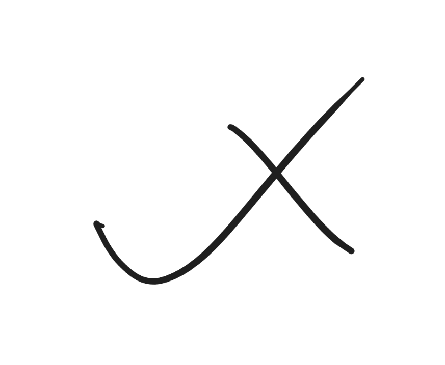

# 个人笔记



## Local preview

Install [uv](https://docs.astral.sh/uv/), then run:

```bash
uv sync --locked
uv run --locked mkdocs build --strict
uv run --locked mkdocs serve
```

- `uv sync --locked` creates or updates `.venv` from the exact versions in `uv.lock`; it does not install packages globally.
- `uv run --locked` refuses to run if `pyproject.toml` and `uv.lock` disagree.
- `mkdocs build --strict` writes the generated site to `site/` and treats warnings as build failures.
- `mkdocs serve` starts the development server on <http://127.0.0.1:8000/> and rebuilds when source files change.
