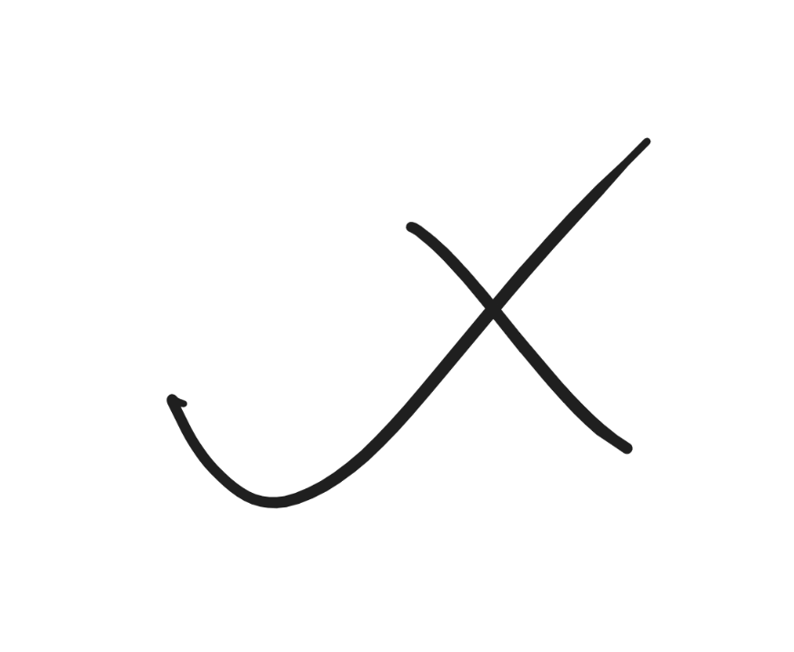

# 个人笔记



## Local preview

Install [uv](https://docs.astral.sh/uv/), then run:

```bash
uv sync --locked
uv run --locked mkdocs build --strict
uv run --locked mkdocs serve
```

- `uv sync --locked` creates or updates `.venv` from the exact versions in `uv.lock`; it does not install packages globally.
- `uv run --locked` refuses to run if `pyproject.toml` and `uv.lock` disagree.
- `mkdocs build --strict` writes the generated site to `site/` and treats warnings as build failures.
- `mkdocs serve` starts the development server on <http://127.0.0.1:8000/> and rebuilds when source files change.

## Domain, Google verification, and project pages

Configure these values in `mkdocs.yml`:

- `site_url` is the canonical site address. The build uses it for page metadata,
  the sitemap, `robots.txt`, and the custom-domain `CNAME` file.
- `extra.google_site_verification` lists Google Search Console HTML verification
  tokens. Each token becomes a separate meta tag; retain tokens that are still in use.
- `extra.sitemap.extra_urls` adds pages built by other repositories to the same
  sitemap. Use a root-relative `path`, such as `/base64-family-codec/`. An optional
  `lastmod: "YYYY-MM-DD"` should reflect an actual content update; omit it when unknown.

After building, run `uv run --locked python scripts/check_seo.py site`. This reads
the generated output and checks its metadata, verification tags, sitemap entries,
`robots.txt`, and `CNAME` against the configuration. It does not publish anything.
The checker accepts `--config-file PATH` for an alternative MkDocs configuration.

After deployment, add the URL-prefix property `https://github.kicey.site/` in
Google Search Console, complete HTML-tag verification, and submit
`https://github.kicey.site/sitemap.xml`. The SPA entries advertise their public
URLs; their HTML remains managed by their own repositories.
