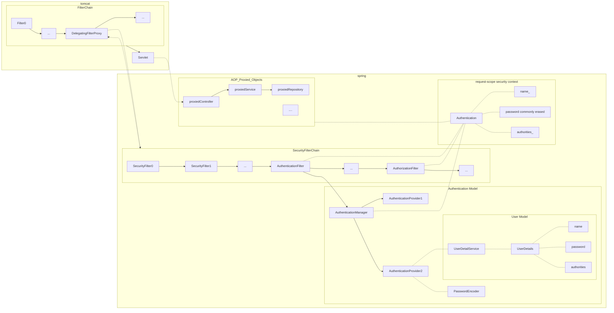

spring security主要做两件事：

1. 认证-authentication
2. 鉴权-authority

先理解spring接受一个请求的大致流程中有关spring security的部分

## 认证

认证主要在某个AuthenticationFilter中完成，这个AuthenticationFilter负责拦截请求，会通过AuthenticationManager进行认证，因为可能有多种认证的方式，那么就依赖多个AuthenticationProvider对请求中的多种认证信息进行认证，普遍的方式会通过UserDetailsService找到对应的UserDetails，UserDetails中存放了id，密码，权限等信息。

密码匹配时通过一个PasswordEncoder进行的。

在认证成功后，将创建一个代表认证状态的Authentication对象，这个对象可以配置不同的生命周期，一般时request，底层通过一个ThreadLocal实现。

认证是在filter中，即在路由这个步骤内完成的。

## 鉴权

鉴权有两种方式

* 通过filter，即在路由的步骤内完成
* 通过AOP，在任何位置完成

不论是哪种方式，都以SecurityContext作为上下文，从其中取出一些认证和授权的信息。AOP的方式可以获取一些其他的调用方法的参数信息，filter的方式可以获取到路径相关的信息。

## 配置

不论是授权和认证

以filter方式进行的流程，都需要在Config中进行配置。

而以AOP方式进行的流程，需要先在Config中开启对应功能，然后在使用注解进行，注解多使用SPEL，在复杂的情况下可以自己实现调用的接口。
