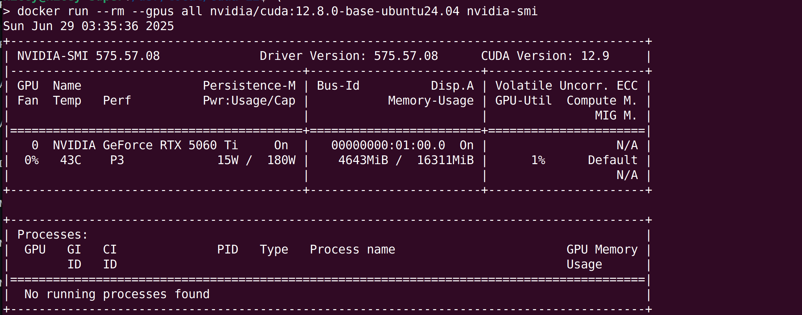

# Installing NVIDIA Driver CUDA Toolkit on Ubuntu for Newer GPUs (e.g. 5060 Ti)

Hello everyone! If you've recently upgraded to a newer NVIDIA GPU, like the powerful 5060 Ti, and are running Ubuntu 24.04 or later, you might have run into issues installing the latest drivers and CUDA Toolkit directly from the standard Ubuntu repositories. This is often because newer hardware requires more up-to-date drivers than what's typically available in the default package sources.

This blog post will guide you through the process of installing the NVIDIA driver (specifically version 575 or newer) and CUDA Toolkit (version 12.8 or newer) by utilizing the official NVIDIA-maintained repositories. This method ensures you get the latest compatible software and allows for easier future updates.

------

## 1. Prerequisites and System Preparation

Before we begin, ensure your system is up to date and you have the necessary tools.

- Operating System: Ubuntu 24.04 LTS (or newer)
- GPU: NVIDIA 5060 Ti (or similar recently released NVIDIA GPU requiring newer drivers)
- Internet Connection: Required for downloading packages.

It's highly recommended to back up your system before proceeding with major driver installations.

First, update your package lists and upgrade any existing packages:

```bash
sudo apt update
sudo apt upgrade -y
```

You might also want to ensure you have the necessary kernel headers and necessary packages for build is  installed, as they are crucial for driver compilation:

```bash
sudo apt install linux-headers-$(uname -r) -y
```

------

## 2. Adding the Official NVIDIA Repository

The key to installing newer drivers is to add the official NVIDIA repository to your system's APT sources. This repository provides the latest drivers and CUDA Toolkit versions directly from NVIDIA.

Just follow this nvidia official link [CUDA Toolkit for ubuntu](https://developer.nvidia.com/cuda-downloads?target_os=Linux&target_arch=x86_64&Distribution=Ubuntu&target_version=24.04&target_type=deb_network) `https://developer.nvidia.com/cuda-downloads?target_os=Linux&target_arch=x86_64&Distribution=Ubuntu&target_version=24.04&target_type=deb_network`

After adding the repository, update your package list again to fetch the new package information:

```bash
wget https://developer.download.nvidia.com/compute/cuda/repos/ubuntu2404/x86_64/cuda-keyring_1.1-1_all.deb
sudo dpkg -i cuda-keyring_1.1-1_all.deb
sudo apt-get update
```

------

## 3. Installing the NVIDIA Driver and cuda toolkit

Now that the NVIDIA repository is configured, you can install the recommended driver. For your 655060 Ti, a driver version of at least 575 is required.

### Installing the cuda-toolkit

```bash
sudo apt-get update
sudo apt-get -y install cuda-toolkit-12-9
```

May you don't want so recent version of cuda-toolkit. The least cuda-tookit version supporting 50 series gpu is 12.8.

### Installing the driver

```bash
sudo apt-get update
sudo apt-get install -y nvidia-open
```

The `cuda-drivers` is also OK. But the the open source one `nvidia-open` is recommended.

During the installation, you may noticed here is something like
```bash
Building initial module nvidia/575.57.08 for 6.8.0-62-generic
Sign command: /usr/bin/kmodsign
Signing key: /var/lib/shim-signed/mok/MOK.priv
Public certificate (MOK): /var/lib/shim-signed/mok/MOK.der
```

If you enable secure boot, you should enroll the public certificate. If secure boot is disabled on your host, you can ignore the output while installation and skip the 4th section.

------

## 4. Addressing Secure Boot and MOK Management

If Secure Boot is enabled on your system, the NVIDIA kernel modules, which are signed with NVIDIA's public key, will not be loaded automatically by default. You will need to enroll this public key into your system's Machine Owner Key (MOK) list.

1. Use command to import the nvidia public certificate
   ```bash
   sudo mokutil --import /var/lib/shim-signed/mok/MOK.der
   ```

   You will be prompted to enter password 2 or 3 times. Decided by if you are prompted to enter the password for `sudo` at first. The last two password is for secure-boot and the ensurement the password(prompted to enter the same password again).

2. MOK Management Screen: Upon rebooting, your system will likely boot into a "MOK management" or "Secure Boot Key Management" screen (this is part of your UEFI/BIOS, not Ubuntu itself).

3. Enroll MOK: Navigate through the options to "Enroll MOK", then "continue". You will then be prompted to enter the password you set just now. This step officially registers NVIDIA's public key with your Secure Boot system.

4. Continue Boot: After successfully enrolling the key, choose to continue booting your system.

------

## 5. Add the CUDA Toolkit Binary to Path

We've install the cuda toolkit in the 3rd step. But the some executable binaries are not in the path. So, you can only access them by the absolute path.

After installation, it's good practice to add CUDA to your system's `PATH` and `LD_LIBRARY_PATH`. You can do this by adding the following lines to your `~/.bashrc` (or `~/.zshrc` if you use Zsh) and then sourcing the file:

```bash
echo 'export PATH=/usr/local/cuda-12/bin$:$PATH' >> ~/.bashrc 
echo 'export LD_LIBRARY_PATH=/usr/local/cuda-12/lib64:$LD_LIBRARY_PATH' >> ~/.bashrc source ~/.bashrc
```

Verify your installation by checking `nvcc --version`:

You should see something like:
```bash
nvcc: NVIDIA (R) Cuda compiler driver
Copyright (c) 2005-2025 NVIDIA Corporation
Built on Tue_May_27_02:21:03_PDT_2025
Cuda compilation tools, release 12.9, V12.9.86
Build cuda_12.9.r12.9/compiler.36037853_0
```

------

## 6. Setting Up Docker with GPU Support (NVIDIA Container Toolkit)

For developers using Docker, you'll want to enable your containers to access the GPU. This requires the NVIDIA Container Toolkit. Fortunately, since you've already added the NVIDIA repository, installing it is straightforward.

1. Install the NVIDIA Container Toolkit: 
   ```bash
   sudo apt install nvidia-container-toolkit
   ```

2. Configure Docker to Use NVIDIA Runtime: You need to tell Docker to use `nvidia` as its default runtime for GPU-enabled containers. And restart docker to make it work. This involves modifying Docker's daemon configuration.
   ```bash
   sudo nvidia-ctk runtime configure --runtime=docker
   sudo systemctl restart docker
   ```
   
   You will say something like this in your `/etc/docker/daemon.json`
   
   ```json
   {	
   	"runtimes": {
           "nvidia": {
               "args": [],
               "path": "nvidia-container-runtime"
           }
       }
   }
   ```

3. Test Your Docker GPU Setup: You can test your setup by running a simple CUDA-enabled Docker image:
   ```bash
   sudo docker run --rm --gpus all nvidia/cuda:12.8.0-base-ubuntu24.04 nvidia-smi
   ```

   You should see the output of `nvidia-smi` from inside the Docker container, indicating successful GPU access.

   

------

## 7. Conclusion

By following these steps, you should have successfully installed the latest NVIDIA driver and CUDA Toolkit on your Ubuntu system, enabling your newer GPU for development and computation. You've also set up Docker to seamlessly leverage your GPU within containers.

## Refreences

* https://developer.nvidia.com/cuda-downloads?target_os=Linux&target_arch=x86_64&Distribution=Ubuntu&target_version=24.04&target_type=deb_network
* https://forums.developer.nvidia.com/t/we-would-like-to-know-when-the-nvidia-drivers-for-5060ti-on-ubuntu-will-be-released/331207
* https://forums.developer.nvidia.com/t/nvidia-drivers-not-working-while-secure-boot-is-enabled-after-updating-to-ubuntu-24-04/305351/6?u=kiceyscream
* https://forums.developer.nvidia.com/t/could-not-select-device-driver-with-capabilities-gpu/80200
* https://docs.nvidia.com/datacenter/cloud-native/container-toolkit/latest/install-guide.html