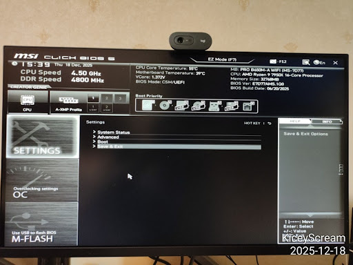
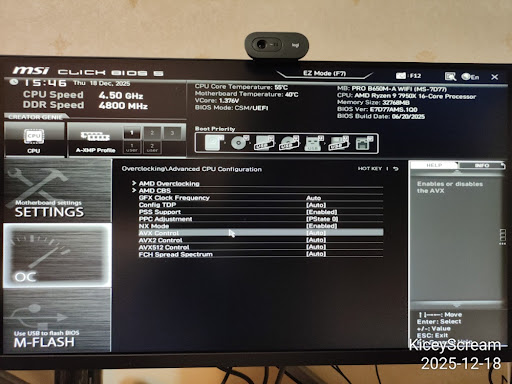
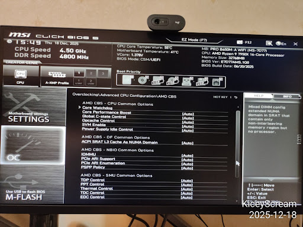
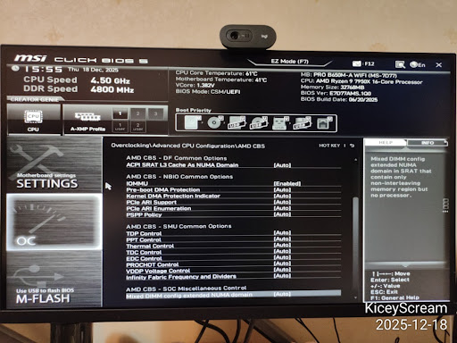
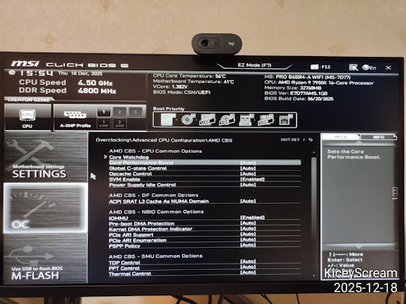
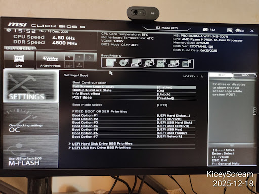

# Proxmox GPU 直连实战教程（AMD Ryzen 9 7950X + NVIDIA RTX 5060 Ti）

<!-- more -->

这篇文章整理自一次完整的排障聊天记录，目标环境如下：

- 宿主机：Proxmox VE（AMD 平台）
- CPU：Ryzen 9 7950X（带 AMD Raphael 核显）
- 主板：MSI PRO B650M-A WIFI
- 需要直连给虚拟机的独显：NVIDIA GeForce RTX 5060 Ti
- 宿主机显示继续使用核显，NVIDIA 独显专供虚拟机

如果你也是类似的 AM5 + NVIDIA 组合，这套流程基本可以直接复用。

------

## 本教程涉及的技术栈

这篇教程不仅是操作步骤，还涉及多层虚拟化与内核机制。理解这些层次会让排障更高效：

1. 固件层（UEFI/BIOS）
	- `SVM`（AMD-V）负责开启 CPU 硬件虚拟化扩展。
	- `IOMMU`（AMD-Vi）负责 DMA 重映射与设备隔离。
	- 使用 UEFI 模式可避免部分 Legacy 初始化行为对 GPU 直连产生干扰。

2. 虚拟化平台层（Proxmox VE）
	- Proxmox 是管理层，真正的虚拟化加速由 Linux `KVM` 完成，设备模型由 `QEMU` 提供。
	- GPU 直连本质是让 QEMU 把真实 PCIe 设备直接交给客户机，而不是使用虚拟显卡。

3. 隔离层（Linux IOMMU 分组）
	- `IOMMU` 的全称是 `Input-Output Memory Management Unit`。
	- 内核会按隔离边界把 PCI 设备划分为 IOMMU groups。
	- 只有分组隔离合理，直连才安全且稳定。

4. 设备绑定层（VFIO）
	- `VFIO` 的全称是 `Virtual Function I/O`。
	- `vfio`（VFIO 核心框架）、`vfio_iommu_type1`（Type-1 IOMMU 后端）、`vfio_pci`（PCI 设备绑定驱动）、`vfio_virqfd`（虚拟中断 eventfd 支持）共同构成用户态虚拟机直连链路。
	- 把显卡绑定到 `vfio-pci` 的目的是阻止宿主机图形驱动抢先占用设备。

5. 引导与模块编排层
	- GRUB 注入内核参数（`amd_iommu=on iommu=pt`）。
	- `initramfs` 保证关键模块和绑定策略在早期启动阶段就可用。
	- `/etc/modules-load.d/` 管理模块自动加载，`/etc/modprobe.d/` 管理模块参数与黑名单策略。

6. 虚拟机硬件配置层
	- `OVMF (UEFI)` + `q35` 提供更贴近现代 PCIe 设备的虚拟平台。
	- `CPU type: host` 暴露更多原生 CPU 特性。
	- 关闭 ballooning 可降低直连场景中的 DMA 稳定性风险。

7. 验证工具链
	- `dmesg`、`/proc/cmdline`、`find /sys/kernel/iommu_groups`、`lspci -nnk` 用于宿主机侧状态确认。
	- `nvidia-smi` 用于客户机侧驱动与运行状态确认。

------

## 1. 最终成功状态

在开始前，先明确最终应该达到的状态：

1. BIOS 里 SVM 和 IOMMU 都已开启。
2. 内核启动参数包含 `amd_iommu=on iommu=pt`。
3. `/sys/kernel/iommu_groups/` 下存在 IOMMU 分组。
4. NVIDIA 显卡两个功能设备都绑定到 `vfio-pci`。
5. 虚拟机使用 `OVMF (UEFI)` + `q35`，并成功挂载 PCI 直连设备。

------

## 2. BIOS 配置（MSI Click BIOS 5）

### 步骤 1：进入高级模式

重启进入 BIOS（一般开机按 `Delete`），切换到 Advanced Mode。



### 步骤 2：进入 AMD CBS

依次进入：

- `OC` -> `Advanced CPU Configuration` -> `AMD CBS`



### 步骤 3：开启虚拟化相关选项

在 AMD CBS 中设置：

- `SVM Enable` -> `Enabled`
- `IOMMU` -> `Enabled`

建议显式设为 `Enabled`，不要依赖 `Auto`。



### 步骤 4：可选稳定性优化

对于 Ryzen 作为长期运行宿主机，可以考虑：

- `Global C-state Control` -> `Disabled`

`Pre-boot DMA Protection`、`PCIe ARI Support` 一般保持 `Auto` 即可。




### 步骤 5：确认 UEFI 启动

在 `Settings` -> `Boot` 中确认：

- `Boot mode select` 为 `UEFI`



保存并重启（`F10`）。

------

## 3. 在 Proxmox 验证并启用 IOMMU

### 步骤 6：先做基础检测

```bash
dmesg | grep -e DMAR -e IOMMU
```

在 AMD 平台上，常见输出类似：

```text
AMD-Vi: IOMMU performance counters supported
Detected AMD IOMMU #0
```

这表示硬件被识别到了，但还需要确认内核参数已生效。

### 步骤 7：添加内核参数（GRUB）

先查看当前启动参数：

```bash
cat /proc/cmdline
```

本次环境中出现了 `root=/dev/mapper/pve-root`，说明是 LVM + GRUB。

编辑：

```bash
nano /etc/default/grub
```

设置：

```bash
GRUB_CMDLINE_LINUX_DEFAULT="quiet amd_iommu=on iommu=pt"
```

应用并重启：

```bash
update-grub
reboot
```

重启后再次验证：

```bash
cat /proc/cmdline
```

确认看到 `amd_iommu=on iommu=pt`。

### 步骤 8：确认 IOMMU 分组存在

快速检查：

```bash
find /sys/kernel/iommu_groups/ -maxdepth 0
```

更严格一点可以看分组条目：

```bash
find /sys/kernel/iommu_groups/ -type l | head
```

只要目录存在且有分组项，IOMMU 就是工作状态。

------

## 4. 开机加载 VFIO 模块

虽然历史上常编辑 `/etc/modules`，但在 systemd 环境下更推荐使用 `/etc/modules-load.d/`。

创建：

```bash
nano /etc/modules-load.d/vfio.conf
```

写入：

```text
vfio
vfio_iommu_type1
vfio_pci
vfio_virqfd
```

更新 initramfs：

```bash
update-initramfs -u -k all
```

如果看到：

```text
No /etc/kernel/proxmox-boot-uuids found, skipping ESP sync.
```

在 GRUB/LVM 布局下属于正常现象。

然后重启：

```bash
reboot
```

------

## 5. 将 NVIDIA 显卡绑定到 vfio-pci

### 步骤 9：识别显卡设备 ID

```bash
lspci -nnk | grep -A 3 "VGA"
```

本次环境识别结果：

- NVIDIA 图形功能：`01:00.0` -> `[10de:2d04]`
- NVIDIA 音频功能：`01:00.1` -> `[10de:22eb]`
- 宿主核显：AMD Raphael `11:00.0`（`amdgpu`）

### 步骤 10：配置 vfio-pci 绑定 ID

创建：

```bash
nano /etc/modprobe.d/vfio.conf
```

写入：

```text
options vfio-pci ids=10de:2d04,10de:22eb disable_vga=1
```

### 步骤 11：屏蔽宿主机 NVIDIA 驱动

创建：

```bash
nano /etc/modprobe.d/blacklist.conf
```

写入：

```text
blacklist nvidia
blacklist nouveau
```

说明：

- 不要屏蔽 `amdgpu`，否则宿主核显会受影响。
- `blacklist radeon` 在现代 Ryzen 核显平台通常不是必须。

应用并重启：

```bash
update-initramfs -u -k all
reboot
```

### 步骤 12：最终验证

```bash
lspci -nnk -d 10de:
```

理想结果：

```text
01:00.0 ... Kernel driver in use: vfio-pci
01:00.1 ... Kernel driver in use: vfio-pci
```

这说明宿主机已经把显卡完整交给 VFIO，具备直连条件。

------

## 6. 创建 Ubuntu 虚拟机（Proxmox UI）

宿主侧绑定完成后，建议新建虚拟机，而不是复用旧的 SeaBIOS 模板。

创建向导建议：

1. OS：选择你的 Ubuntu ISO
2. System：
   - BIOS：`OVMF (UEFI)`
   - Machine：`q35`
   - Graphics：安装阶段保留 `Default` 或 `VirtIO-GPU`
3. CPU：
   - Type：`host`
4. Memory：
   - 关闭 ballooning
5. Network：
   - `VirtIO`

然后添加 PCI 设备：

- `Hardware` -> `Add` -> `PCI Device`
- 选择 `01:00.0`（NVIDIA VGA）
- 勾选：
  - `All Functions`
  - `ROM-Bar`
  - `PCI-Express`

为什么只选 `01:00.0`？

- 因为勾选 `All Functions` 后，会自动把同地址下的 `01:00.1` 音频功能一起直连。

安装 Ubuntu 后，在虚拟机内安装 NVIDIA 驱动，并执行：

```bash
nvidia-smi
```

------

## 7. 常见问题排查

1. 重启后不是 `vfio-pci`：
   - 复查 `vfio.conf`、`blacklist.conf`，并再次执行 `update-initramfs -u -k all`。
2. 没有 IOMMU 分组：
   - 复查 BIOS 中 SVM/IOMMU，以及内核启动参数。
3. 安装器黑屏：
   - 先保留虚拟显示设备完成系统安装，之后再调整显示策略。
4. `lspci` 里看到 `Kernel modules` 但没生效：
   - 关键看 `Kernel driver in use`，不是看模块是否存在。

------

## 8. 总结

当 `01:00.0` 和 `01:00.1` 都显示 `Kernel driver in use: vfio-pci` 时，宿主侧配置就完成了。

此时 Proxmox 不再占用这张 NVIDIA 显卡，虚拟机即可独占使用，性能接近原生。
