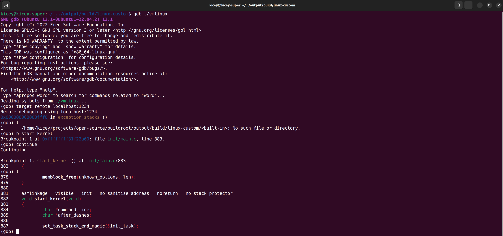
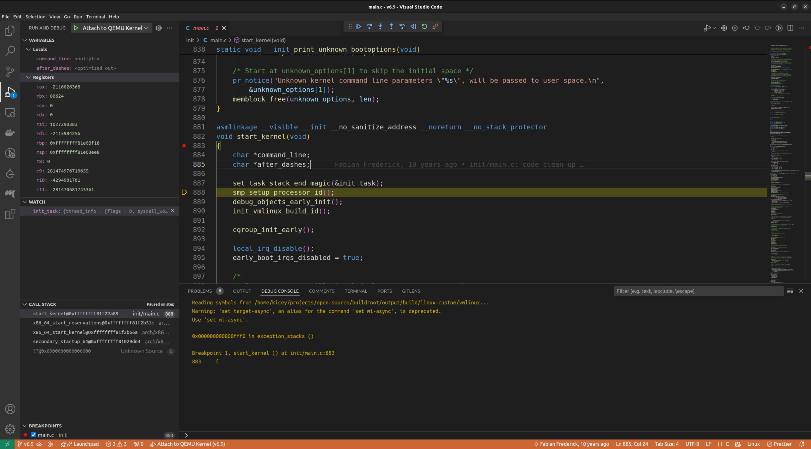

# 使用 buildroot，qemu 调试 linux 内核

## 准备

* buildroot 源码（buildroot 刻意未以二进制的形式发布，详见：[faq-no-binary-packages](https://buildroot.org/downloads/manual/manual.html#faq-no-binary-packages)）
* linux kernel 源码（建议使用 linux 的最新的 release 版本，不要使用 master，博客中使用 6.5 版本）
* qemu（运行 linux kernel 的虚拟机）
* gdb
* vs code

## 配置 buildroot 与 linux

buildroot 项目的目标是简化 linux 系统镜像的构建过程，因此 buildroot 默认使用 linux 官方仓库的代码构建 x86 平台的目标镜像。编译时也不生成调试需要的信息。

所以我们需要先配置 buildroot，实现：

1. 使用适用于构建 qemu 镜像的配置
2. 使用本地的 linux 源码
3. 在编译时添加用于 debug 的符号信息
4. 相关的基础配置

### 使用适用于构建 qemu 镜像的配置

在 buildroot 的根目录下使用 `make qemu_x86_64_defconfig` 使用 x86_64 平台 qemu 的默认配置。

### 使用本地 linux 源码

在 buildroot 的根目录下创建 `local.mk` 文件，添加内容 `LINUX_OVERRIDE_SRCDIR=${path_to_your_kernel_source_code}`，指定构建使用的源码。关于 `local.mk` 以及变量 `LINUX_OVERRIDE_SRCDIR` 的说明见：[Advanced usage](https://buildroot.org/downloads/manual/manual.html#_advanced_usage)。

buildroot 根目录下使用 `make menuconfig` 命令打开 buildroot 配置面板，如下。

>可以使用 `make help` 查看所有选项，需要注意的是 `make help` 并不是 make 本身的功能，这是一种规约，使用 help 作为一个 make 的 target，用于说明当前项目 make 使用的帮助文档。


修改 Kernel -> Kernel version，至源码当前的版本，注意配置界面的左上角，可以在此处看到配置界面的当前“路径”。


修改 Toolchain -> Custom kernel headers series 至源码相同的版本，buildroot 需要提前确定头文件的版本以正确的编译根文件系统。


### 编译时添加符号信息

在 buildroot 使用 `make linux-menuconfig` 进入目标 linux 的配置界面，进入 Kernel hacking（名副其实😀），开启 debug 配置。


选择正确的调试信息（默认无调试信息，选择默认 DWARF 版本的调试信息即可）


暂停浏览 Kernel hacking 中的配置，会发现该配置界面中包含了众多配置选项，包含网络，驱动，内存等等。当前我们打开最基础的 debug 开关即可。

## 编译内核及根文件系统

在 buildroot 根路径下使用 `make` 执行编译。

编译结束之后：

在 `./output/images` 中包含 kernel 和 rootfs 的镜像，以及 qemu 的启动脚本；

>图中包含了额外的 rootfs.ext4 是我个人配置时选择了 ext4 文件系统，仅调试不需要做这一步配置，流程一致。


在 `./output/build/linux-custom` 中包含一个 `vmlinux` 文件，这是未压缩的原始内核镜像。使用 `objdump --debugging ./vmlinux` 命令验证其中包含 gdb 所需的 debug 符号信息（存在大量输出即可）。

## 通过 qemu 运行内核，并做 gdb 的初步验证

### 修改 start-qemu.sh 启动脚本

在 qemu 的启动命令中加入 `-s` `-S` 两个选项；在 `-append` 选项的配置中加入 `nokaslr`，使 qemu 以调试的方式运行 kernel。qemu 会自动的启动 gdb server。

### 启动 qemu 虚拟机 kernel

进入 `./output/build/linux-custom` 路径，执行 `./start-qemu.sh`。将出现 

```
VNC server running on 127.0.0.1:5900
```

代表虚拟机启动成功，并且由于处于调试模式，暂停执行，如果在之后的 gdb 中选择继续执行，将可以看到登陆提示（如下）。


需要注意的是，不熟悉 gdb 的开发者不易准确的判断调试命令对执行过程的影响，如果调试出现问题请回到站 qemu 窗口查看虚拟机状态，适时重启，重新开始调试。

### 命令行启动 gdb

1. 进入 `./output/build/linux-custom` 路径（任何路径均可，该路径更方便后续操作）；

2. 执行 `gdb ./vmlinux` 进入 gdb

3. 将得到一个警告：

   ```bash
   warning: File "/.../buildroot/output/build/linux-custom/scripts/gdb/vmlinux-gdb.py" auto-loading has been declined by your `auto-load safe-path' set to "$debugdir:$datadir/auto-load".
   ```

4. 为了解决上一步中的警告，我们在 `./output/build/linux-custom` 下添加 `.gdbinit` 文件，加入以下内容 `add-auto-load-safe-path .`。
   之后再次执行前 3 步，这个警告不再出现。

5. 执行 target remote localhost:1234 连接 qemu 中的 gdb server

6. 使用 `l` 查看当前执行的代码行，将看到以下结果
   
   原因在于当前执行的代码属于 bootloader 的范畴，也就是还没有执行到 kernel 中的代码。

7. 添加断点 `b start_kernel`，是虚拟机在启动 kernel 时停止，结果如下
   

8. 使用 `continue` 执行到断点，然后使用 `l` 查看当前位置的代码，结果如下
   

9. 查看遇到的第一个变量 `init_task` （iscsi_task 结构体的一个引用）的值，

   ```c
   struct iscsi_task {
   	/*
   	 * Because LLDs allocate their hdr differently, this is a pointer
   	 * and length to that storage. It must be setup at session
   	 * creation time.
   	 */
   	struct iscsi_hdr	*hdr;
   	unsigned short		hdr_max;
   	unsigned short		hdr_len;	/* accumulated size of hdr used */
   	/* copied values in case we need to send tmfs */
   	itt_t			hdr_itt;
   	__be32			cmdsn;
   	struct scsi_lun		lun;
   
   	int			itt;		/* this ITT */
   
   	unsigned		imm_count;	/* imm-data (bytes)   */
   	/* offset in unsolicited stream (bytes); */
   	struct iscsi_r2t_info	unsol_r2t;
   	char			*data;		/* mgmt payload */
   	unsigned		data_count;
   	struct scsi_cmnd	*sc;		/* associated SCSI cmd*/
   	struct iscsi_conn	*conn;		/* used connection    */
   
   	/* data processing tracking */
   	unsigned long		last_xfer;
   	unsigned long		last_timeout;
   	bool			have_checked_conn;
   
   	/* T10 protection information */
   	bool			protected;
   
   	/* state set/tested under session->lock */
   	int			state;
   	refcount_t		refcount;
   	struct list_head	running;	/* running cmd list */
   	void			*dd_data;	/* driver/transport data */
   };
   ```

   结果如下
   

到此为止，linux kernel 的调试已经做到了，可以执行一下其他的 gdb 调试命令，比如下一步，添加断点，执行到断点，查看内存信息等。

## vscode 辅助调试

###  配置 vscode 及插件

* 安装插件 Native Debug

* 打开 linux 源码，注意版本，在项目路径下添加 `./vscode/launch.json` 文件，内容如下：
  ```json
  {
      "version": "0.2.0",
      "configurations": [
          {
              "type": "gdb",
              "request": "attach",
              "name": "Attach to QEMU Kernel",
              "executable": "/home/kicey/projects/open-source/buildroot/output/build/linux-custom/vmlinux",
              "target": "localhost:1234",
              "remote": true,
              "cwd": "${workspaceRoot}",
              "gdbpath": "/usr/bin/gdb",
          }
      ],
      "postRemoteConnectCommands": [
          {
              "text": "source ${workspaceFolder}/.gdbinit"
          }
      ],
  }
  ```

  注意修改 `executable` 项到直接使用 gdb 调试时的 vmlinux。

* 在 linux 项目的路径下添加文件 `.gdbinit`，内容如下：
  ```bash
  add-auto-load-safe-path /
  ```

* 先在 `start_kernel` 函数处设置断点，再如手动调试时一样通过脚本启动 qemu kernel 虚拟机
  
  最后连接调试（点左上角的绿色箭头）

  

  可以看到，断点生效，变量查看生效
  

## 结语

linux 内容的调试配置难度总体还算正常，特别是使用 buildroot 辅助的情况下。

在可以进行内容调试之后，许多平常只能查阅别人描述的系统功能或行为，我们可以先找到对应的处理代码，然后调试验证了；从口说无凭到**代码就是这么跑的！**了（😀）。学习 linux 时更加的有的放矢，脚踏实地。

在遇到一些奇怪的问题时（例如各个发行版的驱动适配，笑）也可以尝试自己解决。

感谢阅读，如有问题，还请不吝赐教。
